   
========================================
软件操作说明
========================================
运行板卡配置软件
========================================
进入 UI 目录以 root 权限运行 pcieBoard_manage 软件，即可进入软件主界面执行相关操作。

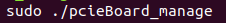
 

图 3-1 运行软件

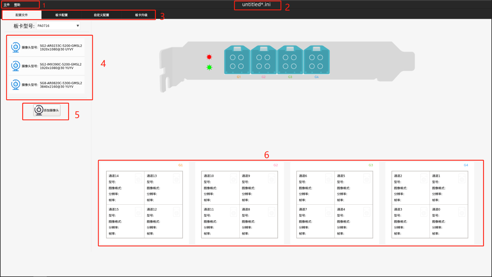
 

图 3-2 软件主界面

- 1 菜单栏 
- 2 标题栏，显示配置文件名 
- 3 界面切换，点击不同的按键，切换到对应功能界面 
- 4 摄像头列表，软件支持的摄像头列表，可点击拖动至右侧的通道内，配置通道的摄像头参数 
- 5 添加自定义摄像头 
- 6 采集卡 16 路通道配置信息，接收摄像头列表拖动配置的摄像头信息。软件界面上显示的通道分布与实际板卡上的通道分布完全一致 

生成板卡配置文件
========================================
新建配置文件
^^^^^^^^^^^^^^^^^^^^^^^^^^^^^^^^^^^^^^^^
点击菜单栏的文件项，在弹出的文件菜单下，点击新建项生成空白配置文件。

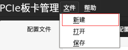
 

图 3-3 新建配置文件

配置通道
^^^^^^^^^^^^^^^^^^^^^^^^^^^^^^^^^^^^^^^^
根据板卡通道连接的摄像头型号，在摄像头列表中找到对应的摄像头，拖动该摄像头
至相应的通道。如果不小心拖动配置了错误的摄像头，可点击通道组右上方的小标清除配
置信息，如果图 3-4 中的 G1，或者也可以拖动其他摄像头覆盖原来的配置。

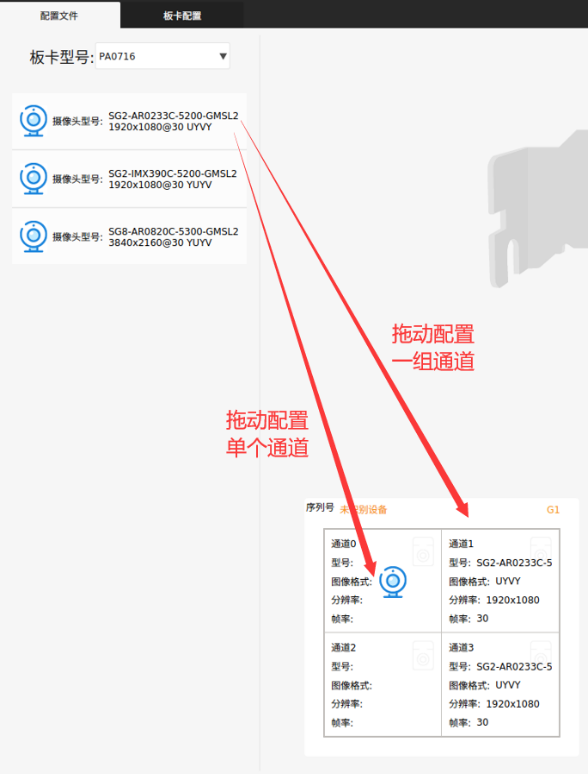
 

图 3-4 拖动配置

生成配置文件
^^^^^^^^^^^^^^^^^^^^^^^^^^^^^^^^^^^^^^^^
点击菜单栏的文件项，在弹出的文件菜单下，点击保存项，输入文件名，生成配置文件

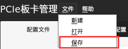
 

图 3-5 保存文件

.. warning:: 如果用户想配置的摄像头分辨率和摄像头列表中的分辨率不一致，也可以直接编辑修改配置文件中的分辨率项。

打开板卡配置文件
========================================
点击菜单栏的文件项，在弹出的文件菜单下，点击打开项，选择想要打开的配置文件，确定，主界面标题栏将显示对应的文件名，通道将显示对应的配置信息。

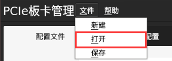
 

图 3-6 打开文件

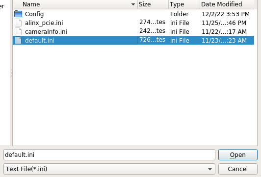
 

图 3-7 选择文件

配置板卡
========================================
此操作要求通道已经接入摄像头，配置才能生效

切换功能界面
^^^^^^^^^^^^^^^^^^^^^^^^^^^^^^^^^^^^^^^^
板卡的配置界面不在主界面，需要点击板卡配置，将界面切换至板卡配置功能界面。

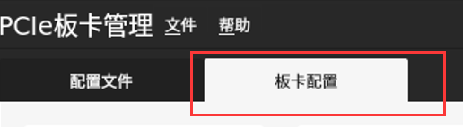
 

图 3-8 切换功能界面

板卡添加配置文件
^^^^^^^^^^^^^^^^^^^^^^^^^^^^^^^^^^^^^^^^
板卡配置界面展示的是 Ubuntu 系统接入并识别到的板卡，上面展示了板卡设备的部分
信息。针对操作者想要配置的板卡，在该板卡展示框内点击添加配置文件，然后点击配置按
钮，等待配置完成。如果想要对多块板卡同时配置，就在对应的板卡展示框内点击添加配置
文件，然后点击配置即可。

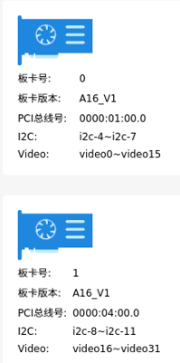
 

图 3-9 板卡信息

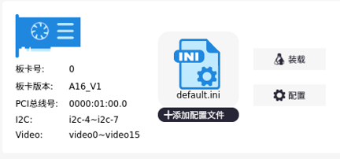
 

图 3-10 添加配置文件

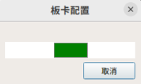
 

图 3-11 板卡配置中

.. warning:: 当接口线或者摄像头拔插后，需要重新按上述配置步骤配置板卡。

板卡自启动配置
========================================
如果需要在 Ubuntu 系统启动时自动加载配置文件，对板卡进行配置，请在需要自动配
置的板卡框内添加配置文件，点击装载按钮，完成设置。

 

图 3-12 添加配置文件

通道时间戳同步设置
========================================
板卡默认支持 PTP 网络同步，在上电后同步功能将自动开启，只需要将板卡通过网线连
接到 PTP 服务器，就能实现板卡对 PTP 服务器的同步。
板卡启动后通道默认采用的是 Ubuntu 系统的时间戳，如果要给通道打上板卡的时间戳，
需要在板卡的对应通道，点击滑动按键，右滑后，通道的时间戳将被配置为板卡的时间戳。
注意，只有接入了摄像头并且配置完成后的通道才有效果。

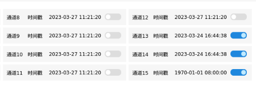
 

图 3-13 通道打上板卡时间戳

自定义摄像头
========================================
软件的配置信息是针对摄像头列表内摄像头型号的，如果用户需要对其他型号的摄像头
进行配置，或者针对配置信息有需要进行修改的地方，可以在自定义配置界面输入相关的串
行器和解串器的配置信息，生成用户自定义的摄像头型号。然后依照上面的配置操作生成配
置信息，完成对板卡的自定义配置。

切换功能界面
^^^^^^^^^^^^^^^^^^^^^^^^^^^^^^^^^^^^^^^^
板卡的自定义配置界面不在主界面，需要点击自定义配置，将界面切换至自定义配置功能界面。

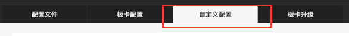
 

图 3-14 切换功能界面

输入配置信息
^^^^^^^^^^^^^^^^^^^^^^^^^^^^^^^^^^^^^^^^
在表格中输入配置信息，然后修改摄像头的参数，最后点击记录文件按键生成自定义的
摄像头配置文件。可以点击表格上侧的载入文件按键加载已记录的摄像头配置文件。

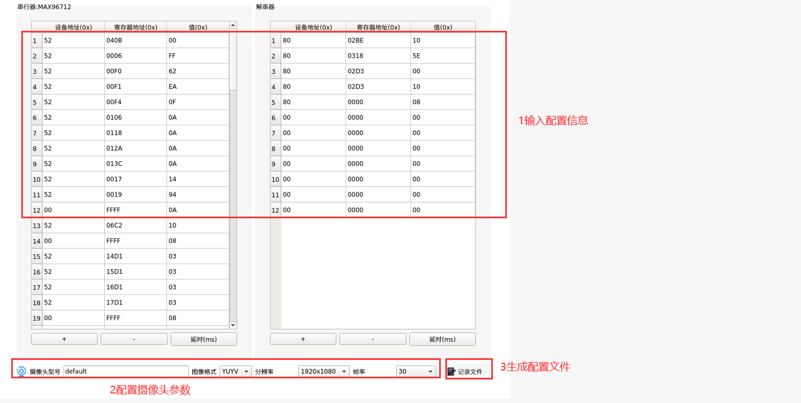
 

图 3-15 输入摄像头信息

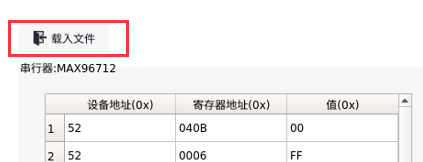
 

图 3-16 加载摄像头文件

摄像头配置文件的使用
^^^^^^^^^^^^^^^^^^^^^^^^^^^^^^^^^^^^^^^^
在主功能界面，点击添加摄像头按键，选择摄像头配置文件，点击打开，可以看到一条
新的摄像头型号信息添加到了摄像头列表中。

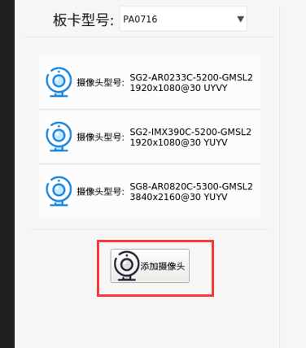
 

图 3-17 添加摄像头

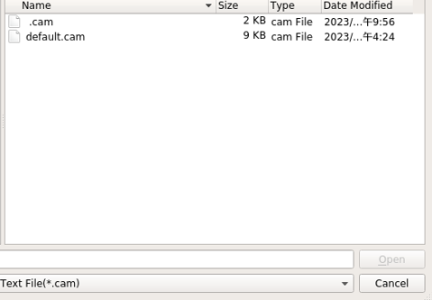
 

图 3-18 选择文件

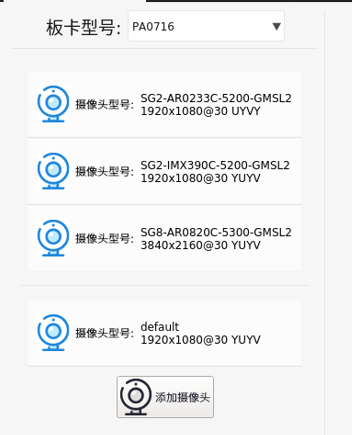
 

图 3-19 摄像头添加至列表

板卡升级
========================================
切换功能界面
^^^^^^^^^^^^^^^^^^^^^^^^^^^^^^^^^^^^^^^^
板卡的升级界面不在主界面，需要点击板卡升级，将界面切换至板卡升级功能界面。

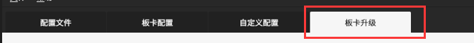
 

图 3-20 切换功能界面

升级
^^^^^^^^^^^^^^^^^^^^^^^^^^^^^^^^^^^^^^^^
在下拉框内，将板卡切换到需要进行升级的板卡，选择升级文件，点击升级按键，等待
升级完成。

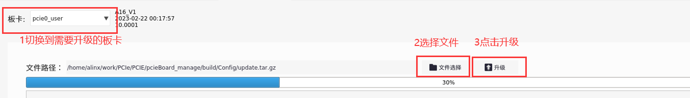
 

图 3-21 升级

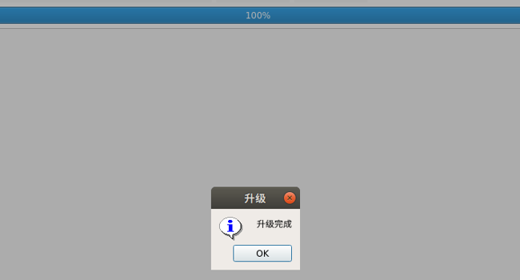
 

图 3-22 升级完成

.. image:: images/images_0/888.png 
   :align: center 

*A16 车载摄像头 GMSL 采集卡*    - `AUMO官方网站 <https://www.aumo.cn>`_