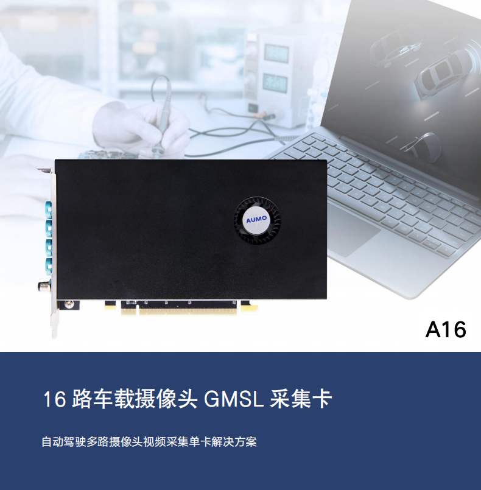

========================================
   引言
========================================

车载摄像头 GMSL 采集卡 A16,是由芯驿电子科技（上海）有限公司提供的一款针对自
动驾驶多路摄像头数据采集需求的单卡解决方案,只需要1个PCIE3.0X16槽位,就可以实
现16路摄像头的视频采集,并提供PTP时间戳功能,保证16路视频数据的同步性,是工控
机IPC自动驾驶方案的最佳选择。

针对购买了A16采集卡的用户,为了让用户能够上手使用该板卡,而提供了板卡相关功
能的操作手册,针对用户使用过程中可能出现的问题提供了相应的解决方法。并且针对用户
在使用过程中可能出现的其他问题及问题的解决方法,操作手册将会不断更新。

- 公司网址:  https://www.aumo.cn
- 技术论坛:  http://www.heijin.org
- 邮箱:  support@alinx.com
- 电话:  021-67676997
- 传真： 021-37737073
- AUMO微信公众号:

*A16 车载摄像头 GMSL 采集卡*    - `AUMO官方网站 <https://www.aumo.cn>`_