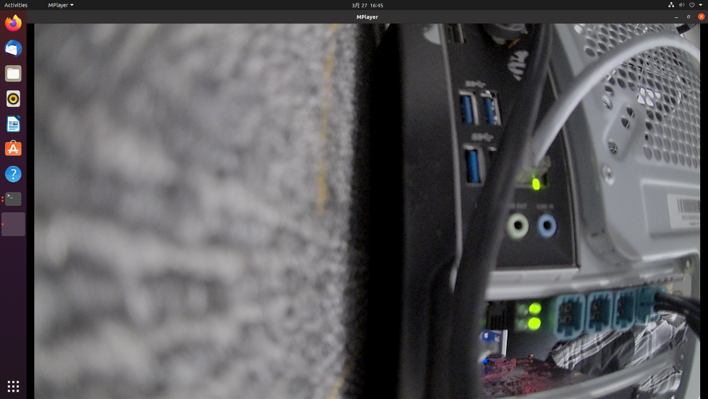
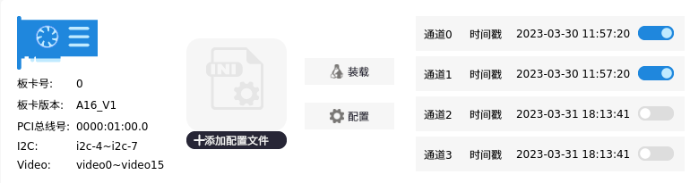
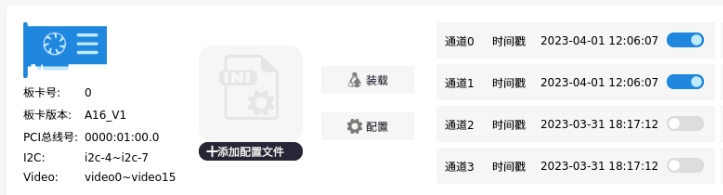

.. image:: images/images_0/88.png  
   :align: center 

========================================
板卡功能验证
========================================
配置验证
========================================

在板卡配置完成之后，使用下载好 mplayer 系统软件查看某一路摄像头。如果想查看
video0 对应的摄像头图像， 在 终 端 输 入 mplayer tv:// -tv driver=v4l2:
device=/dev/video0:width=1920:height=1080:fps=30 命令。

 

图 4-1 摄像头显示

4.2 时间同步验证
本次时间同步功能的验证是用另外一块 A16 板卡作为 PTP 服务器，和测试板卡连接到
同一台交换机内，用户也可以直接将测试板卡通过网线和 PTP 服务器连接。当测试板卡网线
没有接入到交换器上时，开启时间戳同步功能后，板卡时间如图 4-2，当测试板卡接入到交
换机后，板卡时间如图 4-3。

 

图 4-2 时间同步前
 

 

图 4-3 时间同步后

.. image:: images/images_0/888.png 
   :align: center 

*A16 车载摄像头 GMSL 采集卡*    - `AUMO官方网站 <https://www.aumo.cn>`_